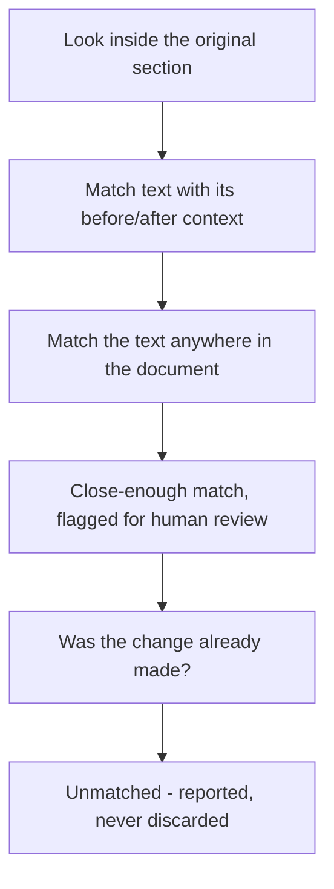

# Markdown Annotator

Leave comments and suggested edits on a Markdown file without touching the
prose, and keep them with the file.

If you have ever reviewed a document by pasting quotes into chat ("in the third
paragraph of *Known issues*, change 'adressed' to 'addressed'"), you know the
problem. The feedback lives somewhere else than the text, it goes stale the
moment someone edits the file, and nobody can tell which notes were already
handled. This project puts the feedback *in* the document, in a form that both
people and tools can read.

## What's in here

| Path | What it is |
| --- | --- |
| [simple-editor/index.html](simple-editor/index.html) | A single-file editor you can open in a browser. No install, no build. |
| [SPECIFICATION.md](SPECIFICATION.md) | The rules: where annotations are stored and how they are found again after edits. |
| [schema.json](schema.json) | The JSON Schema the annotation payload must satisfy. |

## Try it in two minutes

1. Open [simple-editor/index.html](simple-editor/index.html) in a browser
   (double-click it, or drag it onto a browser window).
2. A sample document loads. Select any text in the rendered view.
3. A small popup appears: **Comment**, **Reword**, **Add**, **Delete**. Pick one,
   fill in the form on the right, save the annotation.
4. Click **Save .md (embedded)** to download the document with your annotations
   appended, or **Save .annotations** for a separate file.

To review your own file, drag a `.md` or `.mdx` onto the page. Drag a
`.annotations` file on top of it to load existing feedback. Your work is kept in
browser local storage, so a reload won't lose it; **Reset storage** clears it and
brings back the sample.

## The four things you can say

| Operation | Means | Changes the document? |
| --- | --- | --- |
| `comment` | "Here's a thought about this passage." | No |
| `reword` | "Replace this with that." | Yes |
| `add` | "Insert this text here." | Yes |
| `delete` | "Remove this." | Yes |

A `comment` is a conversation. The other three are concrete proposals that a
person or an agent can apply.

## Where the annotations live

Two options, same JSON either way.

**Embedded** — appended to the end of the Markdown file, after a `---`
separator, inside a fenced `json:annotation` block:

````markdown
# My document

The actual content.

---
```json:annotation
{ "schemaVersion": "1.0.0", "entries": [ ... ] }
```
````

This is the default, because the feedback travels with the file through email,
Git, and copy-paste. A Markdown renderer that knows the extension hides the
block; one that doesn't shows it as a code block.

**Sidecar** — a separate file next to the document, named by *appending*
`.annotations` to the full filename:

```text
README.md        ->  README.md.annotations
Component.mdx    ->  Component.mdx.annotations
```

Use this when the document itself must stay untouched. If both exist, the
embedded block wins and the mismatch is reported — never silently merged.

## Why annotations survive edits

The hard part isn't storing feedback, it's finding the right spot again after
the document has moved on. Line numbers break immediately. So each entry
records what it points at, plus the text just before and just after it, plus the
heading it lived under.

Finding it again is a ladder. Each rung is tried in order, and the first hit
wins:



That fifth rung matters more than it sounds. If someone already fixed the typo,
the original text is gone — but that's success, not failure. The tool checks
whether the suggested result is now sitting between the recorded before and
after context, and marks the entry as handled instead of crying about a missing
match.

Every result carries a confidence label: `exact`, `relocated` (found, but the
section changed), `fuzzy` (needs a human to confirm), `applied`, or `unmatched`.
Only `exact` is safe to apply unattended.

## Nothing is ever thrown away

Each entry keeps a timeline of events — created, submitted, addressed,
unmatched, deleted. "Deleting" an annotation appends a `deleted` event; it does
not erase history. Tick **show deleted** in the editor to see them again.

This is deliberate. In a review you want to know what was asked, what was done
about it, and what was dropped on purpose.

## For tool builders

If you're writing something that reads or writes these annotations — an
extension, a linter, an agent — read [SPECIFICATION.md](SPECIFICATION.md). It is
normative, with a conformance checklist at the end. The short version:

- Validate against [schema.json](schema.json); reject unknown `schemaVersion`
  values rather than guessing.
- Treat the payload as data. Never execute or render values from it.
- Preserve properties you don't understand when rewriting.
- Don't fall back to the sidecar when an embedded block is broken. Report it.

## Status

Specification version 1.0.0, schema version 1.0.0. The editor in
[simple-editor/](simple-editor/index.html) is a reference implementation and a
playground — it has no server, no dependencies beyond a bundled Mermaid build,
and it keeps everything on your machine.
